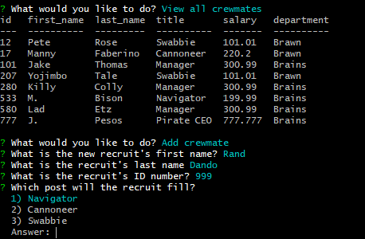

# My Crew Viewer

## Description
This Javascript application runs in Node.js to view and modify the workforce of a very honorable privateer, using a MySQL relational database. Users can view the roster of crewmates, and can filter their results by role and department. Users can also add crewmates, roles, and departments to the database, and lastly can update the role of an existing crewmate.

A video of the application in action is included [here](https://drive.google.com/file/d/1uFhCftoPeio43IbkOE5xC-rHEFU6sOok/view) and can also be accessed via link in the [Screenshots](#screenshots) section further in this document.

## Table of Contents
* [Technologies Used](#technologies-used)
* [How to Access](#how-to-access)
* [What I Did](#what-i-did)
* [Code Snippets](#code-snippets)
* [Screenshots](#screenshots)
* [Acknowledgments](#acknowledgments*)
* [Who I Am](#who-i-am)

---

## Technologies Used
* [Javascript](https://www.javascript.com/) to develop the algorithms included in this web application.
* [Node.js](https://nodejs.org/en/docs/) to run this Javascript program in the terminal/Git Bash console.
* [MySQL](https://www.mysql.com/) for persistent relational database structuring.
* [Git](https://git-scm.com/) for distributed version control, tracking changes over time and making them visible to collaborators.
* [Github](https://github.com/) for version control in the cloud, saving my changes and presenting them clearly to myself and others.

## How to Access
1. Download the contents of this repository to your local machine. 
2. Using the terminal/Git Bash Navigate to the directory containing the contents of this repository, named team-prof-gen by default.
3. Run the command `npm install` in the terminal to install the **inquirer** and **mysql** node package module dependencies.
4. Copy the contents of schema.sql and seeds.sql and run them in MySQL Workbench together to establish the database structure necessary for the app to function.
5. Run the command `node tracker.js` in the terminal to launch the program.
6. Enter your responses as prompted in the terminal, and your database of crew members will be updated accordingly!

---

## What I Did
I used a series of inquirer prompts to capture user input, which then populated specific database columns depending on the rules defined using Javascript in `tracker.js`. Using the query method included in the **mysql** node package module, I used the SQL commands SELECT, JOIN, INSERT, and UPDATE to use the data from the inquirer.prompt() promise to modify values of the `workforce` database.

## Code Snippets 
The code snippet below defines the function viewCrew(), which is called from the main menu when the user selects "View all crewmates." First a SQL query statement is prepared as a string to be used by the connection.query() method. The crewmates' ID number, first name, last name, title, salary, and department are displayed from the database table *employee*. Columns from the tables *role* and *division* are linked to the *employee* table by their respective role_id and department_id, for rows in *employee* whose role_id and department_id match values in *role* and *division*. 

In the anonymous function passed to connection.query, after a brief error catch the results of the query (represented by the parameter "res") are displayed to the console in table format with console.table(res). Finally, choiceTime() is called again which returns the user to the main menu options.

```javascript
function viewCrew() {
    var query = "SELECT id, first_name, last_name, title, salary, department FROM employee AS e LEFT JOIN role AS r ON e.role_id = r.role_id LEFT JOIN division AS d ON d.department_id = r.department_id"
    
    connection.query(query, function(err, res) {
        if (err) throw err;
        console.table(res);

        choiceTime();
    });
}
```

## Screenshots
Example of app running in the command line:



The table on the top half of the image above is the result of choosing the "View all crewmates" option. Below the table, the user has just chosen to "Add crewmate" and is progressing through the inquirer questions.

[Click here](https://drive.google.com/file/d/1uFhCftoPeio43IbkOE5xC-rHEFU6sOok/view) to see a short video demonstrating usage of the application.

---

## Acknowledgments
* [W3Schools](https://www.w3schools.com/) has been my go-to for descriptive tutorials on HTML, CSS, and Javascript syntax and best practices. I am eternally grateful for their massive store of documentation.
* [MDN Web Docs](https://developer.mozilla.org/en-US/) is another resource for documentation on HTML, CSS, and Javascript that I find myself using more and more often as I work through deeper Javascript.
* [Inquirer](https://www.npmjs.com/package/inquirer) is an open source node package that I used to provide interactive command line prompts in this project.


## Who I Am
My name is Rand Hale, and I am an aspiring programmer/web developer based in California.

* [LinkedIn](https://www.linkedin.com/in/rand-hale-83ba389b/)
* [GitHub](https://github.com/prophetrand)